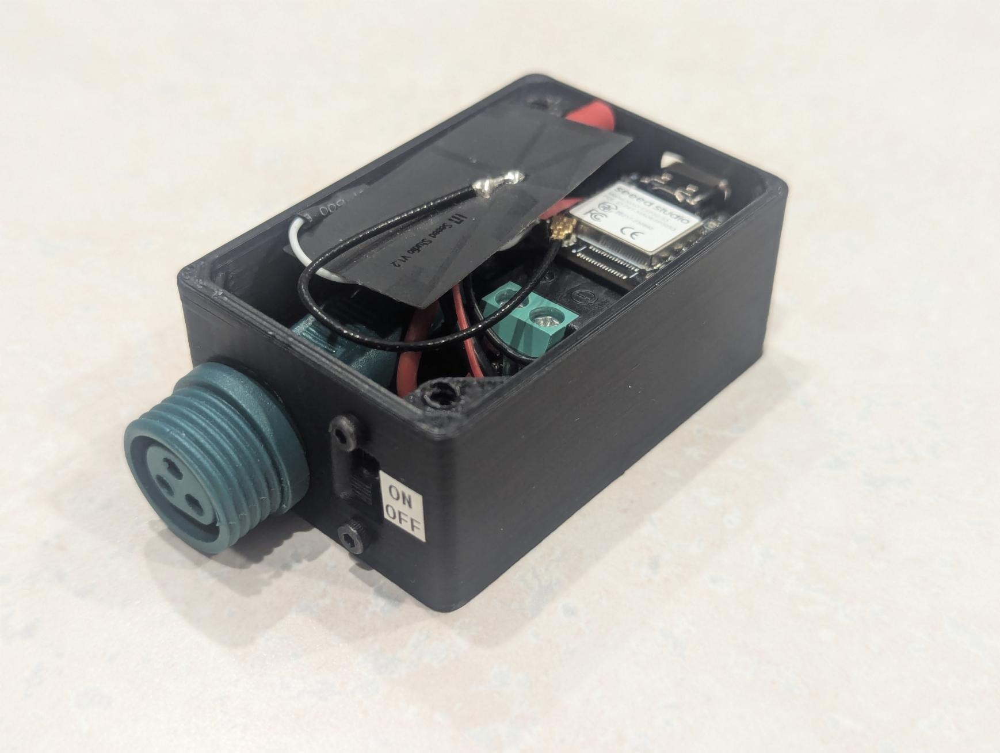
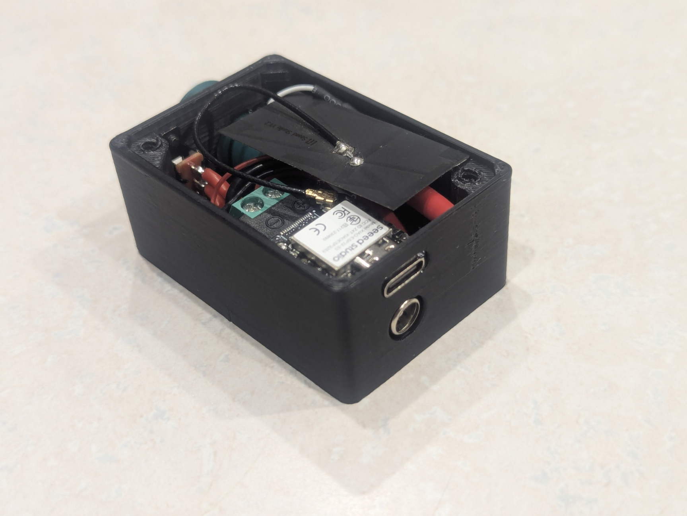
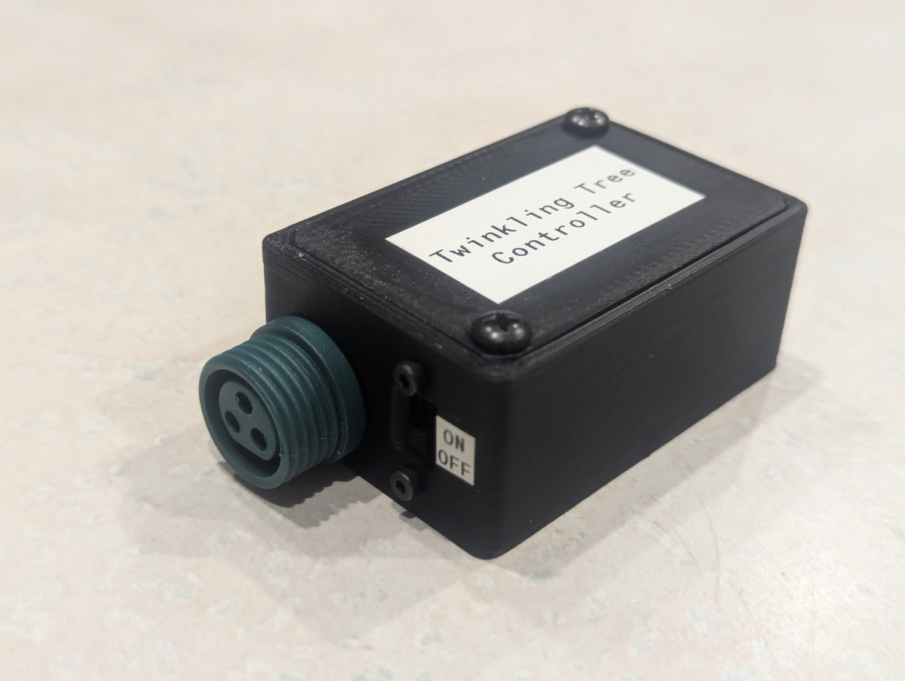
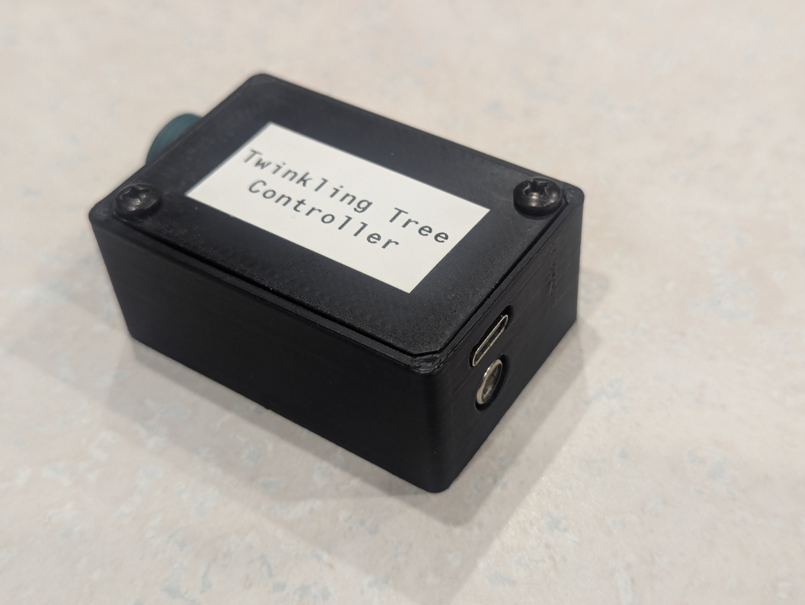

# Twinkling-Tree
Lighting animations for addressible LEDs strung in a big tree.

## Overview
Lighting controller for a 100-pixel WS2811 LED string wrapped in a tree. Built with ESP32-S3 for wireless control and OTA firmware updates.

## Features

| Feature | Description |
|---------|-------------|
| **Animations** | Fairy (twinkling), Wave, Static animation modes with configurable speed and density |
| **Color Modes** | Rainbow (random HSV), Phase (cycling spectrum), Solid (multi-color palette) |
| **RemoteXY Control** | Bluetooth Low Energy interface for real-time parameter adjustment ([UI Editor](https://remotexy.com/en/editor/2dc1c206949c8a04f0c603a0390d7583/)) |
| **Persistent Settings** | Stores GUI settings in EEPROM (see the [RemoteXY EEPROM docs](https://remotexy.com/en/help/library/eeprom/) for more information) |
| **OTA Updates** | Over-the-air firmware updates via WiFi (fallback to USB if unavailable) |
| **Independent Trunk** | Separate color and brightness control for trunk LEDs (0-26) vs branch LEDs (27-99) |
| **Hardware** | Seeed XIAO ESP32-S3, 12V/5A power supply, WS2811 RGB LEDs |

## Control Box
This project is currently running on a [Seeed Studio Xiao ESP32-S3](https://wiki.seeedstudio.com/xiao_esp32s3_getting_started/), and is set up to control a 12V 100-pixel string of WS2811 LEDs. The exact string doesn't seem to be available on Amazon anymore (I bought it way back in 2018), but it is very similar to [this alternative](https://a.co/d/foZtGD6), with the only meaningful difference being the connector. Power comes in through a barrel jack connector from a 12V 5A power supply, and a RC BEC down-regluates this to 5V to supply the Xiao. A diode between the BEC and Xiao prevents USB 5V from back-feeding into the BEC. The MCU board, BEC, barrel jack connector, LED connector, and a power switch are assembled into a 3D-printed enclosure, shown below.

## Images
<table cellspacing="2" cellpadding="0">
  <tr>
    <td width="50%"></td>
    <td width="50%"></td>
  </tr>
  <tr>
    <td width="50%"></td>
    <td width="50%"></td>
  </tr>
</table>

## Notes
This control box won't win any beauty contests, but it keeps all the electronic bits from moving relative to each other, and that's all I was going for. Future versions might involve a custom PCB and a nicer enclosure, but that isn't a priority right now.

The ESP32-S3 is entirely overkill, but I had it laying around. We can take advantage of its built-in wireless connectivity to easily support both RemoteXY (Bluetooth) and OTA Updates (Wi-Fi)

